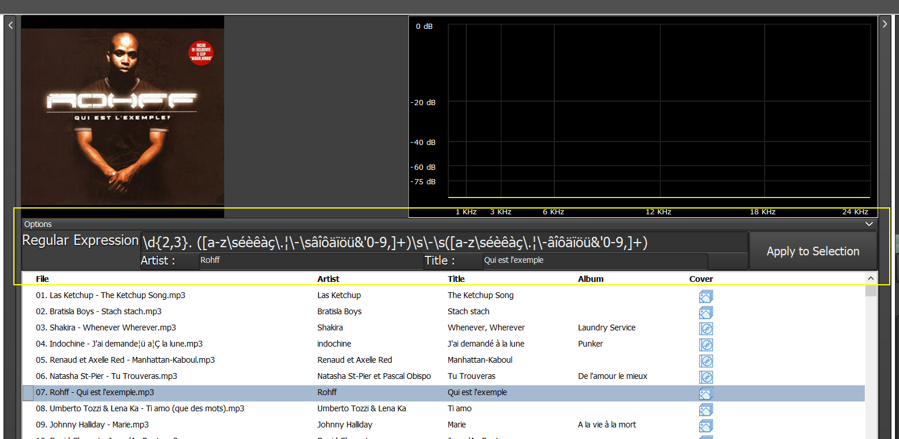
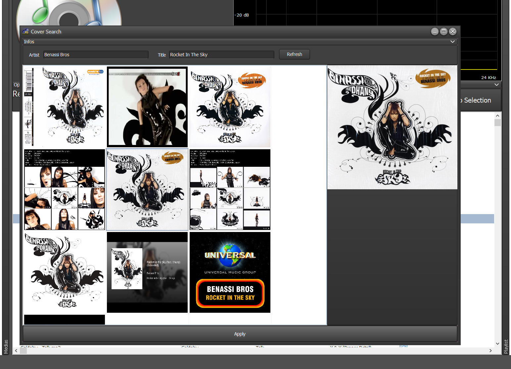

# MyOwnPlayer

A very simple MP3 tags and covers editor.

What's new in version 0.0.1.4 ?

  ## Introducing RegEx engine to extract Tags (Artist and Title) from file name
  
  ### How to use it ?
  When browsing the entries in the grid, the fields "Artit" and "Title" in the panel "**Options**" will present a preview of the RegEx's result.
  There is 2 ways to apply the RegEx to the media file :
  - Click on the button **Apply to Selection**  It will execute the RegEx on **_EVERY_** line selected in the grid.
  - Press '?' in the Grid (_not in edit mode_) will execute the RexEx on the current line only.

**WARNING** The modifications are immediates and the file will be modified on the disk.

## Cover Search Window updated

### How to use it ?
When in the grid, press "INSERT" or use right-click + "Search Cover" to open the window and automatically launch the cover search.
If the "Artist" and/or "Title" tags are present, they will be used for the search.
Otherwise, the filename will be used.

If the grid does not show any satisfying cover, it is still possible to modify the search criterias and start a new search by clicking on "Refresh" button.

Once the cover is selected in the grid, You can apply it to the file by pressing "Enter" or clicking on "Apply" button.

[[embed url=https://www.youtube.com/watch?v=R6fapwIB7tY]]